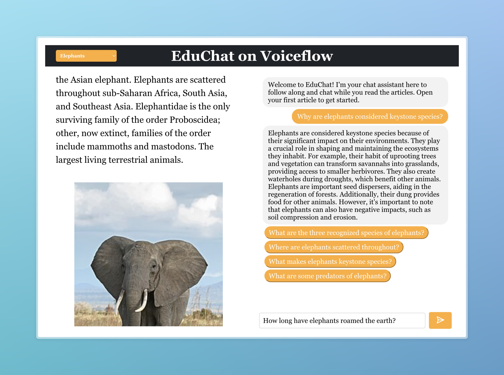
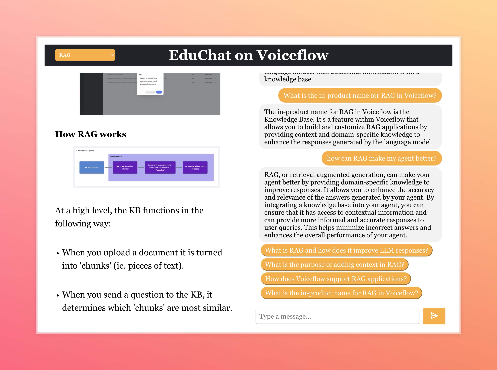

# Voiceflow EduChat

This is an AI app built in React. It enhances learning outcomes and interactivity by following along with students' reading of articles, asking questions, and engaging in conversation.



## Features

- Load articles in a JSON format into the reader
- Ask EduChat clarifying questions about the article as well as broader questions, with knowledge sourced from the article and a custom knowledge base
- Automatically suggest conversation starters to the user based on the article content, to encourage further and engaging with the content.



## Setup

- Clone the repository
- Run `npm install` to install dependencies
- Import the `EduChat.vf` file into a new project on Voiceflow
- Create a `.env` file with the API key for the Voiceflow project from the integrations tab
```
REACT_APP_VF_API_KEY=<API_KEY>
```
- Run `npm start` to start the development server

## Adding Articles

The articles are in a JSON format. To be added to the website, first make sure to add them to `articleList.json` in the `src` folder. Then, add the article content to the `articles` folder in the `public` folder.

The articles themselves are in the following JSON format:

### 1. Article Title
Add the title of the article as a string under the `"title"` key.

```json
"title": "Your Article Title"
```

### 2. Article Body
The `"body"` key contains an array of content blocks. Each block is an object with a specific `"type"`.

#### Text Block
Add a text block with type `"text"` and the content under `"content"`.

```json
{
    "type": "text",
    "content": "Your text content."
}
```

#### Heading Block
Add a heading block with type `"heading"`, the level of the heading under `"level"` (e.g., 2 for `<h2>`, 3 for `<h3>`), and the content under `"content"`.

```json
{
    "type": "heading",
    "level": 2,
    "content": "Your Heading Content"
}
```

#### List Block
Add a list block with type `"list"`, containing an array of items under `"items"`. Each item is an object with its own type and content.

```json
{
    "type": "list",
    "items": [
        {
            "type": "text",
            "content": "List item text."
        },
        {
            "type": "image",
            "link": "https://your-image-url.com/image.png",
            "caption": "Optional caption"
        }
    ]
}
```

#### Image Block
Add an image block with type `"image"`, the URL of the image under `"link"`, and an optional caption under `"caption"`.

```json
{
    "type": "image",
    "link": "https://your-image-url.com/image.png",
    "caption": "Optional caption"
}
```

#### Code Block
Add a code block with type `"code"` and the content under `"content"`.

```json
{
    "type": "code",
    "content": "Your code content."
}
```

#### Link Block
Add a link block with type `"link"`, the display text under `"content"`, and the URL under `"url"`.

```json
{
    "type": "link",
    "content": "Link text",
    "url": "https://your-link-url.com"
}
```

### Example of a Complete Article JSON

```json
{
    "title": "Example Article",
    "body": [
        {
            "type": "text",
            "content": "This is an example text block."
        },
        {
            "type": "heading",
            "level": 2,
            "content": "Example Heading"
        },
        {
            "type": "list",
            "items": [
                {
                    "type": "text",
                    "content": "List item 1."
                },
                {
                    "type": "text",
                    "content": "List item 2."
                }
            ]
        },
        {
            "type": "image",
            "link": "https://example.com/image.png",
            "caption": "Example caption."
        },
        {
            "type": "code",
            "content": "console.log('Example code block');"
        },
        {
            "type": "link",
            "content": "Example Link",
            "url": "https://example.com"
        }
    ]
}
```
